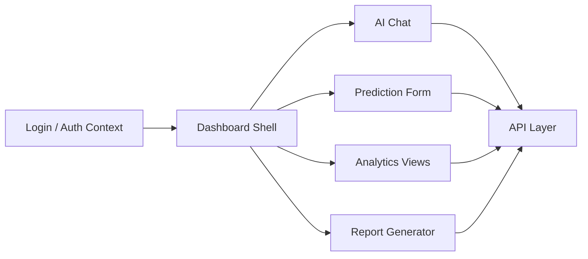

# AppleO - AI Analytics Dashboard Prototype

AppleO is a TypeScript/React dashboard prototype for AI-assisted analytics workflows. It brings together chat, prediction forms, report generation, authentication context, and reusable dashboard components into a product-style frontend.

## Recruiter Quick Look

| What to check | Why it matters |
| --- | --- |
| [Live surface](https://siddhantdamre.github.io/AppleO/) | Product overview and next demo direction. |
| `AIChat.tsx` | AI assistant/chat interface concept. |
| `Dashboard.tsx`, `AdvancedAnalytics.tsx` | Analytics UI and visualization surfaces. |
| `PredictionForm.tsx` | ML/product workflow interaction. |
| `ReportGenerator.tsx` | Report generation flow. |
| `AuthContext.tsx`, `Login.tsx`, `api.ts` | Auth and API wiring. |
| `docs/DEMO_ROADMAP.md` | Plan for a deployable frontend demo. |

## Product Concept

AppleO is strongest as a product engineering sample: a dashboard shell that shows how AI features can fit into an operational analytics workflow rather than living as disconnected scripts.

## Architecture

## Tech Stack

`TypeScript` `React` `Next.js-style components` `Dashboard UI` `AI Chat` `Analytics Workflows`

## Repository Map

| Path | Purpose |
| --- | --- |
| `AIChat.tsx` | Assistant/chat interface. |
| `Dashboard.tsx` | Main dashboard surface. |
| `AdvancedAnalytics.tsx` | Analytics view. |
| `PredictionForm.tsx` | Prediction input flow. |
| `ReportGenerator.tsx` | Report generation flow. |
| `AuthContext.tsx`, `Login.tsx` | Auth flow. |
| `api.ts` | API wiring. |

## Current Demo State

The GitHub Pages surface explains the concept and links the repository. The next strong demo is a Vercel deployment with mocked data, working navigation, and screenshots for every major flow.

## Roadmap

- Add a Vercel-ready static/mock deployment.
- Add screenshots for chat, analytics, prediction, and report flows.
- Add a mock API layer so the demo works without private backend services.
- Add a typed sample dataset and chart fixtures.
- Add a short architecture diagram to the live surface.

## License

MIT
